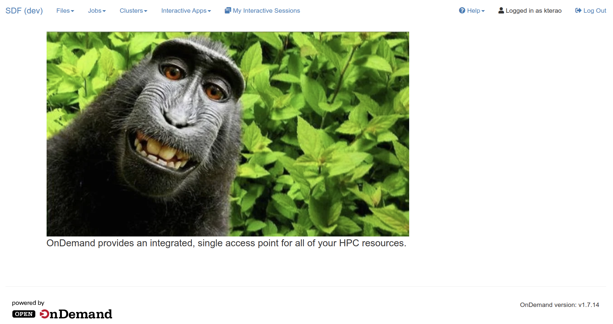
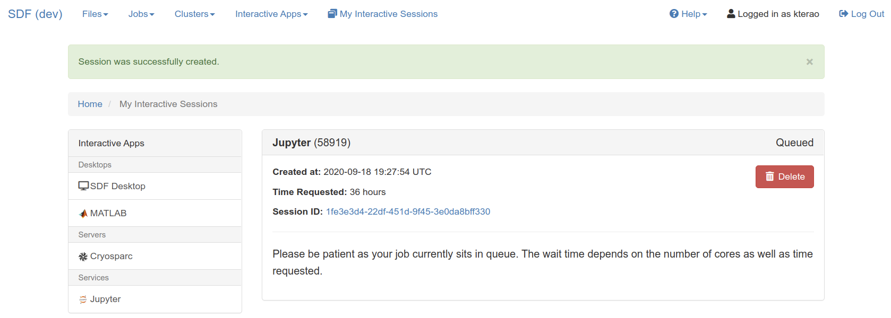
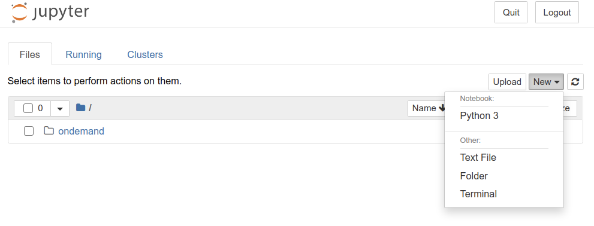
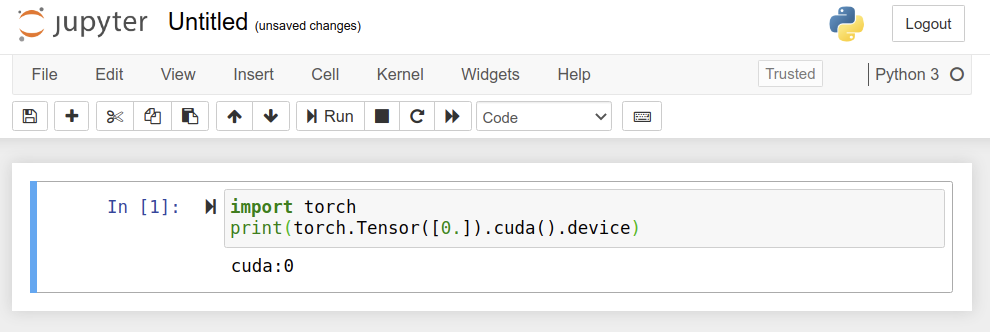
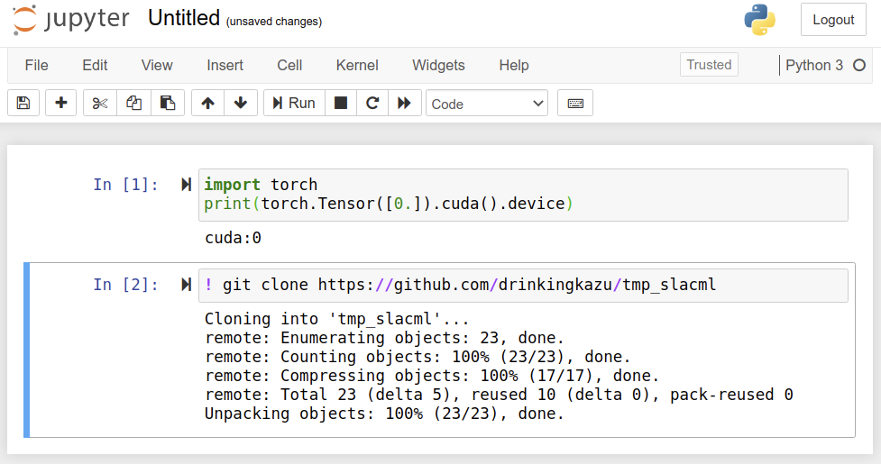

# Set up SLAC computing environment

Please read and follow the below steps as soon as you can so that we can ensure that we run into minimal issues on the day of the classes. If you have any problems, feel free to email Yee at ytl@slac.stanford.edu or to contact us on the SLAC #ml-class Slack channel.

## Accounts and Access
Many of you already have SLAC UNIX accounts, however, the SDF will be using SLAC Windows accounts. This is in accordance to a long term goal to simplify our operational infrastructure and reduce the technical debt that we have accumulated.
If you do not already have a SLAC Windows account, you can create one if you already have a UNIX account by visiting http://ad-account.slac.stanford.edu/. Note that you will need to have your SLAC training up-to-date.

## Getting started

### 1. Login
* Goto https://ondemand-dev.slac.stanford.edu in your favorite web browser. You are more than welcome to browse the documentation.
* Click on the "Login" button
* You will be presented with a CILogin screen: This allows us to provide delegated authentication so that you may log on with non-SLAC credentials. As with all good things, you'll have to wait for this feature to be implemented.
* Select **SLAC National Accelerator Laboratory** from the drop down list.
* The standard SLAC single-sign-on-page will be presented: enter your SLAC Windows credentials. You may also be asked for your '2-factor' key using Duo.
* You should be presented with the 'ondemand' frontend that looks like below



### 2. Launch jupyter
- at the top of the 'ondemand' webpage that we just logged into, click on 'Interactive Apps'
- Select 'Jupyter' from the list
- You should be presented with a set of options to launch a Jupyter instance
- Select 
  - Jupyter Instance: blah
  - leave "Use JupyterLab" unchecked
  - Partition: ml
  - Number of hours: 4
  - Number of CPU cores: 4
  - Total Memory to allocate: 12228
  - Number of GPUs: 1
  - GPU Type: Any
- Click on the big blue 'Launch' button at the bottom. That should bring you to "Interactive Sessions" page like below.



### 3. Wait

- After a few moments, the webpage should update with a 'Connect to Jupyter Instance' button


- clicking on this will bring up a Jupyter window. That should bring you to Jupyter homepage. We call this **home tab**.


### 4. Verify it works
- Start a new notebook by selecting "New" => "Python 3" like shown below


- That should open a new tab. Let's call this a **notebook tab**. You should see a screen like below.


- Type 2 lines of command in the cell: 
```
import torch
print(torch.Tensor([0.]).cuda().device)
```
... and _execute_ the cell (you can either hit "Run" button on the top, or hit "shift+enter" on your keyboard. If you see any error, please contact [Kazu](mailto:kterao@slac.stanford.edu).



- Next, let's checkout the code repository we will use for the workshop! _Add a new cell_ by hitting "+" button on the top (next to sissors :)). That should add a new cell to type more commands. Type the following command and execute again.
```
git clone https://github.com/drinkingkazu/tmp_slacml
```
... it should look like below (and again, if not, [hit Kazu](mailto:kterao@slac.stanford.edu)!).



- Now go back to the **home tab** and you should see 2 new items.
  - Untitled.ipynb ... this is the _notebook_ you created and run some commands there
  - tmp_slacml ... this is the directory, or a `git` repository, you just checked out. The workshop materials will be made available there.

### 5. Party!
Congrats! You have your computing instance up and running = ready for the workshop ... **hardware-wise** :)

We assume some minimal knowledge about Python and scientific libraries. You just checked out the workshop repository, so you can go there and explore `tmp_slacml/Preparation` directory, or [read a brief documentation here](https://github.com/drinkingkazu/tmp_slacml/blob/master/Preparation/README.md). There are notebooks named **Python-0X-YYY.ipynb**. Start from 01 and try to look at look at all of them. You can execute all notebooks and see what happens. Modify and observe a difference in behavior. Again, [hit Kazu](mailto:kterao@slac.stanford.edu) for questions!


    ```
